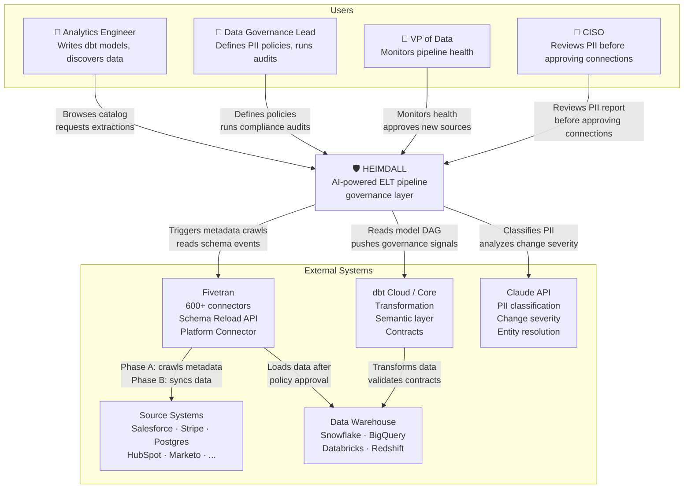

# System Context Diagram

```mermaid
graph TB
    subgraph Users["Users"]
        AE["👤 Analytics Engineer\nWrites dbt models, discovers data"]
        GOV["👤 Data Governance Lead\nDefines PII policies, runs audits"]
        VP["👤 VP of Data\nMonitors pipeline health"]
        CISO["👤 CISO\nReviews PII before approving connections"]
    end

    HEIMDALL["🛡️ HEIMDALL\nAI-powered ELT pipeline\ngovernance layer"]

    subgraph External["External Systems"]
        FIVETRAN["Fivetran\n600+ connectors\nSchema Reload API\nPlatform Connector"]
        DBT["dbt Cloud / Core\nTransformation\nSemantic layer\nContracts"]
        CLAUDE["Claude API\nPII classification\nChange severity\nEntity resolution"]
        SOURCES["Source Systems\nSalesforce · Stripe · Postgres\nHubSpot · Marketo · ..."]
        WH["Data Warehouse\nSnowflake · BigQuery\nDatabricks · Redshift"]
    end

    AE -->|"Browses catalog\nrequests extractions"| HEIMDALL
    GOV -->|"Defines policies\nruns compliance audits"| HEIMDALL
    VP -->|"Monitors health\napproves new sources"| HEIMDALL
    CISO -->|"Reviews PII report\nbefore approving connections"| HEIMDALL

    HEIMDALL -->|"Triggers metadata crawls\nreads schema events"| FIVETRAN
    HEIMDALL -->|"Reads model DAG\npushes governance signals"| DBT
    HEIMDALL -->|"Classifies PII\nanalyzes change severity"| CLAUDE

    FIVETRAN -->|"Phase A: crawls metadata\nPhase B: syncs data"| SOURCES
    FIVETRAN -->|"Loads data after\npolicy approval"| WH
    DBT -->|"Transforms data\nvalidates contracts"| WH
```
