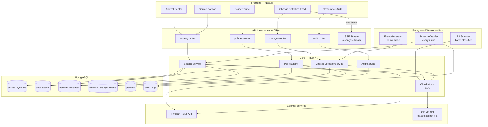

# Component Diagram

```mermaid
graph TB
    subgraph Frontend["Frontend — Next.js"]
        UI_CC[Control Center]
        UI_CAT[Source Catalog]
        UI_CHG[Change Detection Feed]
        UI_POL[Policy Engine]
        UI_AUD[Compliance Audit]
    end

    subgraph API["API Layer — Axum / Rust"]
        R_CAT[catalog router]
        R_CHG[changes router]
        R_POL[policies router]
        R_AUD[audit router]
        SSE[SSE Stream\n/changes/stream]
    end

    subgraph Core["Core — Rust"]
        SVC_CAT[CatalogService]
        SVC_CHG[ChangeDetectionService]
        SVC_POL[PolicyEngine]
        SVC_AUD[AuditService]
        AI[ClaudeClient\nai.rs]
    end

    subgraph Worker["Background Worker — Rust"]
        CRAWLER[Schema Crawler\nevery 2 min]
        PII_SCAN[PII Scanner\nbatch classifier]
        EVT_GEN[Event Generator\ndemo mode]
    end

    subgraph DB["PostgreSQL"]
        T_SRC[(source_systems)]
        T_ASSET[(data_assets)]
        T_COL[(column_metadata)]
        T_CHG[(schema_change_events)]
        T_POL[(policies)]
        T_AUD[(audit_logs)]
    end

    subgraph External["External Services"]
        FIVETRAN[Fivetran REST API]
        CLAUDE[Claude API\nclaude-sonnet-4-6]
    end

    UI_CC & UI_CAT --> R_CAT
    UI_CHG --> R_CHG
    UI_CHG -->|"live alerts"| SSE
    UI_POL --> R_POL
    UI_AUD --> R_AUD

    R_CAT --> SVC_CAT
    R_CHG --> SVC_CHG
    R_POL --> SVC_POL
    R_AUD --> SVC_AUD

    SVC_CAT --> T_SRC & T_ASSET & T_COL
    SVC_CHG --> T_CHG & T_ASSET
    SVC_POL --> T_POL & T_COL
    SVC_AUD --> T_AUD

    CRAWLER --> SVC_CAT
    PII_SCAN --> AI
    EVT_GEN --> SVC_CHG

    SVC_CAT --> AI
    SVC_CHG --> AI
    AI --> CLAUDE

    CRAWLER --> FIVETRAN
    SVC_CAT --> FIVETRAN
```
