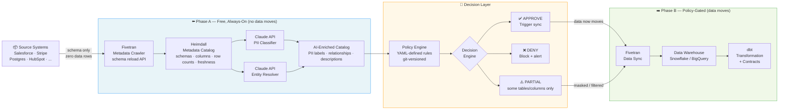

# Data Flow — Phase A (Metadata-Only) → Phase B (Policy-Gated Extraction)

```mermaid
flowchart LR
    SRC["📦 Source Systems\nSalesforce · Stripe\nPostgres · HubSpot · ..."]

    subgraph PhaseA["⬅️  Phase A — Free, Always-On (no data moves)"]
        direction TB
        FTV["Fivetran\nMetadata Crawler\nschema reload API"]
        CATALOG["Heimdall\nMetadata Catalog\nschemas · columns · row counts · freshness"]
        AI_PII["Claude API\nPII Classifier"]
        AI_ENT["Claude API\nEntity Resolver"]
        ENRICHED["AI-Enriched Catalog\nPII labels · relationships · descriptions"]
    end

    subgraph Decision["🧠 Decision Layer"]
        POLICY["Policy Engine\nYAML-defined rules\ngit-versioned"]
        DEC{"Decision\nEngine"}
        APPROVE["✅ APPROVE\nTrigger sync"]
        DENY["❌ DENY\nBlock + alert"]
        PARTIAL["⚠️ PARTIAL\nsome tables/columns only"]
    end

    subgraph PhaseB["➡️  Phase B — Policy-Gated (data moves)"]
        FTV_SYNC["Fivetran\nData Sync"]
        WH["Data Warehouse\nSnowflake / BigQuery"]
        DBT["dbt\nTransformation\n+ Contracts"]
    end

    SRC -->|"schema only\nzero data rows"| FTV
    FTV --> CATALOG
    CATALOG --> AI_PII
    CATALOG --> AI_ENT
    AI_PII --> ENRICHED
    AI_ENT --> ENRICHED
    ENRICHED --> POLICY
    POLICY --> DEC
    DEC --> APPROVE
    DEC --> DENY
    DEC --> PARTIAL
    APPROVE -->|"data now moves"| FTV_SYNC
    PARTIAL -->|"masked / filtered"| FTV_SYNC
    FTV_SYNC --> WH
    WH --> DBT

    style PhaseA fill:#e8f4f8,stroke:#2196F3
    style PhaseB fill:#f0f8e8,stroke:#4CAF50
    style Decision fill:#fff8e8,stroke:#FF9800
```
