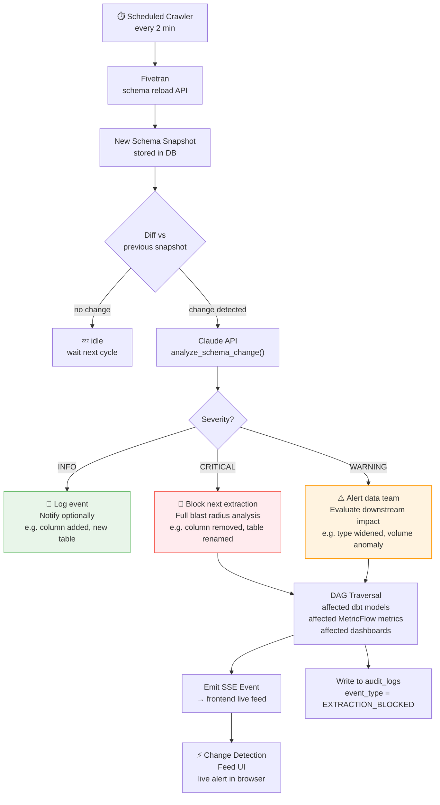

# Change Detection Flow

```mermaid
flowchart TD
    CRON["⏱️ Scheduled Crawler\nevery 2 min"] --> RELOAD["Fivetran\nschema reload API"]
    RELOAD --> SNAP["New Schema Snapshot\nstored in DB"]
    SNAP --> DIFF{"Diff vs\nprevious snapshot"}

    DIFF -->|"no change"| IDLE["💤 idle\nwait next cycle"]
    DIFF -->|"change detected"| CLASSIFY["Claude API\nanalyze_schema_change()"]

    CLASSIFY --> SEV{"Severity?"}

    SEV -->|"INFO"| LOG_INFO["📝 Log event\nNotify optionally\ne.g. column added, new table"]
    SEV -->|"WARNING"| WARN["⚠️ Alert data team\nEvaluate downstream impact\ne.g. type widened, volume anomaly"]
    SEV -->|"CRITICAL"| BLOCK["🚨 Block next extraction\nFull blast radius analysis\ne.g. column removed, table renamed"]

    BLOCK --> LINEAGE["DAG Traversal\naffected dbt models\naffected MetricFlow metrics\naffected dashboards"]
    WARN --> LINEAGE

    LINEAGE --> SSE_EMIT["Emit SSE Event\n→ frontend live feed"]
    LINEAGE --> AUDIT_WRITE["Write to audit_logs\nevent_type = EXTRACTION_BLOCKED"]

    SSE_EMIT --> UI["⚡ Change Detection\nFeed UI\nlive alert in browser"]

    style BLOCK fill:#ffebee,stroke:#f44336
    style WARN fill:#fff3e0,stroke:#FF9800
    style LOG_INFO fill:#e8f5e9,stroke:#4CAF50
```
