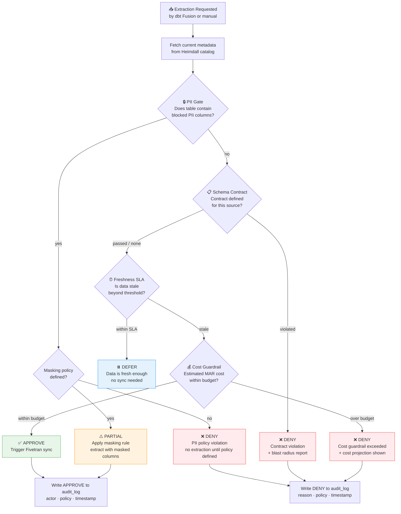

# Policy Evaluation Flow

```mermaid
flowchart TD
    TRIGGER["📥 Extraction Requested\nby dbt Fusion or manual"] --> FETCH_META["Fetch current metadata\nfrom Heimdall catalog"]

    FETCH_META --> P1{"🔒 PII Gate\nDoes table contain\nblocked PII columns?"}
    P1 -->|"yes"| MASK{"Masking policy\ndefined?"}
    MASK -->|"yes"| APPLY_MASK["⚠️ PARTIAL\nApply masking rule\nextract with masked columns"]
    MASK -->|"no"| DENY_PII["❌ DENY\nPII policy violation\nno extraction until policy defined"]

    P1 -->|"no"| P2{"📋 Schema Contract\nContract defined\nfor this source?"}
    P2 -->|"violated"| DENY_CONTRACT["❌ DENY\nContract violation\n+ blast radius report"]
    P2 -->|"passed / none"| P3{"⏰ Freshness SLA\nIs data stale\nbeyond threshold?"}

    P3 -->|"within SLA"| DEFER["⏸️ DEFER\nData is fresh enough\nno sync needed"]
    P3 -->|"stale"| P4{"💰 Cost Guardrail\nEstimated MAR cost\nwithin budget?"}

    P4 -->|"over budget"| DENY_COST["❌ DENY\nCost guardrail exceeded\n+ cost projection shown"]
    P4 -->|"within budget"| APPROVE["✅ APPROVE\nTrigger Fivetran sync"]

    APPROVE --> AUDIT_OK["Write APPROVE to audit_log\nactor · policy · timestamp"]
    APPLY_MASK --> AUDIT_OK
    DENY_PII --> AUDIT_DENY["Write DENY to audit_log\nreason · policy · timestamp"]
    DENY_CONTRACT --> AUDIT_DENY
    DENY_COST --> AUDIT_DENY

    style APPROVE fill:#e8f5e9,stroke:#4CAF50
    style DEFER fill:#e3f2fd,stroke:#2196F3
    style DENY_PII fill:#ffebee,stroke:#f44336
    style DENY_CONTRACT fill:#ffebee,stroke:#f44336
    style DENY_COST fill:#ffebee,stroke:#f44336
    style APPLY_MASK fill:#fff3e0,stroke:#FF9800
```
