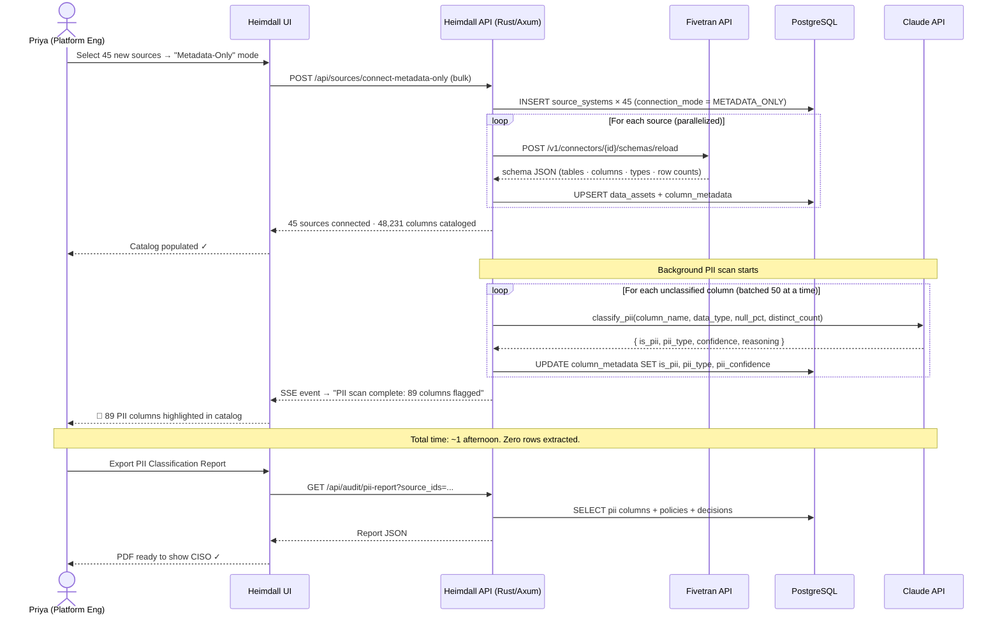

# Sequence Diagram — "Day Zero" Journey

> Connect 60 source systems in metadata-only mode in one afternoon.
> AI immediately classifies PII. Zero data moves.

```mermaid
sequenceDiagram
    actor Priya as Priya (Platform Eng)
    participant UI as Heimdall UI
    participant API as Heimdall API (Rust/Axum)
    participant FTV as Fivetran API
    participant DB as PostgreSQL
    participant AI as Claude API

    Priya->>UI: Select 45 new sources → "Metadata-Only" mode
    UI->>API: POST /api/sources/connect-metadata-only (bulk)
    API->>DB: INSERT source_systems × 45 (connection_mode = METADATA_ONLY)

    loop For each source (parallelized)
        API->>FTV: POST /v1/connectors/{id}/schemas/reload
        FTV-->>API: schema JSON (tables · columns · types · row counts)
        API->>DB: UPSERT data_assets + column_metadata
    end

    API-->>UI: 45 sources connected · 48,231 columns cataloged
    UI-->>Priya: Catalog populated ✓

    Note over API,AI: Background PII scan starts

    loop For each unclassified column (batched 50 at a time)
        API->>AI: classify_pii(column_name, data_type, null_pct, distinct_count)
        AI-->>API: { is_pii, pii_type, confidence, reasoning }
        API->>DB: UPDATE column_metadata SET is_pii, pii_type, pii_confidence
    end

    API-->>UI: SSE event → "PII scan complete: 89 columns flagged"
    UI-->>Priya: 🔴 89 PII columns highlighted in catalog

    Note over Priya,AI: Total time: ~1 afternoon. Zero rows extracted.

    Priya->>UI: Export PII Classification Report
    UI->>API: GET /api/audit/pii-report?source_ids=...
    API->>DB: SELECT pii columns + policies + decisions
    API-->>UI: Report JSON
    UI-->>Priya: PDF ready to show CISO ✓
```
