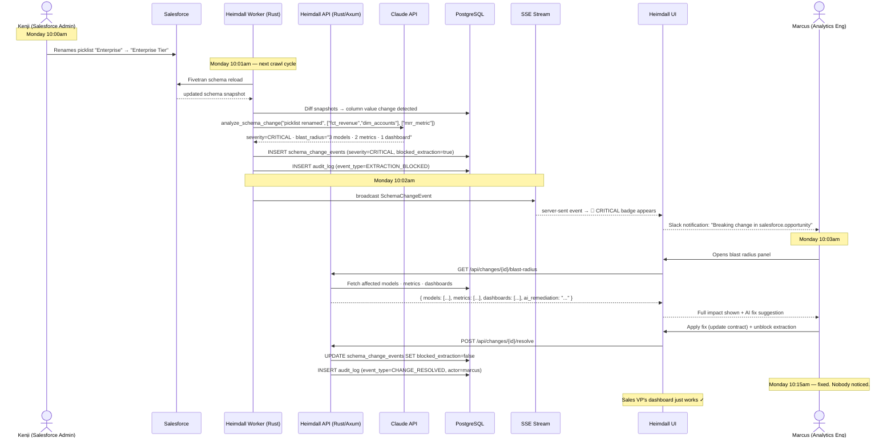

# Sequence Diagram — "Breaking Change" Journey

> Salesforce admin renames a field. Heimdall catches it in 1 minute,
> shows blast radius, engineer fixes it before anyone notices.

```mermaid
sequenceDiagram
    actor Kenji as Kenji (Salesforce Admin)
    participant SF as Salesforce
    participant WORKER as Heimdall Worker (Rust)
    participant API as Heimdall API (Rust/Axum)
    participant AI as Claude API
    participant DB as PostgreSQL
    participant SSE as SSE Stream
    participant UI as Heimdall UI
    actor Marcus as Marcus (Analytics Eng)

    Note over Kenji: Monday 10:00am
    Kenji->>SF: Renames picklist "Enterprise" → "Enterprise Tier"

    Note over WORKER: Monday 10:01am — next crawl cycle
    WORKER->>SF: Fivetran schema reload
    SF-->>WORKER: updated schema snapshot
    WORKER->>DB: Diff snapshots → column value change detected
    WORKER->>AI: analyze_schema_change("picklist renamed", ["fct_revenue","dim_accounts"], ["mrr_metric"])
    AI-->>WORKER: severity=CRITICAL · blast_radius="3 models · 2 metrics · 1 dashboard"
    WORKER->>DB: INSERT schema_change_events (severity=CRITICAL, blocked_extraction=true)
    WORKER->>DB: INSERT audit_log (event_type=EXTRACTION_BLOCKED)

    Note over WORKER,SSE: Monday 10:02am
    WORKER->>SSE: broadcast SchemaChangeEvent
    SSE-->>UI: server-sent event → 🔴 CRITICAL badge appears
    UI-->>Marcus: Slack notification: "Breaking change in salesforce.opportunity"

    Note over Marcus: Monday 10:03am
    Marcus->>UI: Opens blast radius panel
    UI->>API: GET /api/changes/{id}/blast-radius
    API->>DB: Fetch affected models · metrics · dashboards
    API-->>UI: { models: [...], metrics: [...], dashboards: [...], ai_remediation: "..." }
    UI-->>Marcus: Full impact shown + AI fix suggestion

    Marcus->>UI: Apply fix (update contract) + unblock extraction
    UI->>API: POST /api/changes/{id}/resolve
    API->>DB: UPDATE schema_change_events SET blocked_extraction=false
    API->>DB: INSERT audit_log (event_type=CHANGE_RESOLVED, actor=marcus)

    Note over Marcus: Monday 10:15am — fixed. Nobody noticed.
    Note over UI: Sales VP's dashboard just works ✓
```
