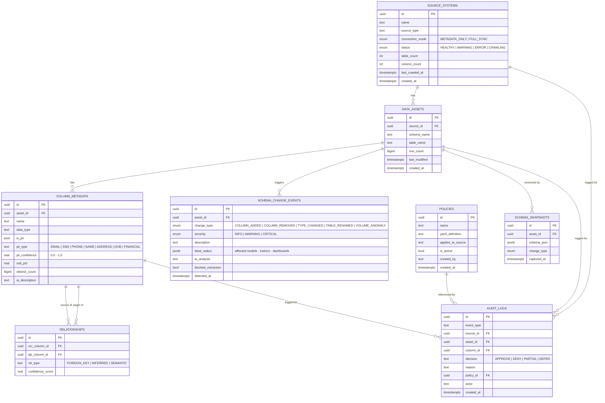

# Entity Relationship Diagram

```mermaid
erDiagram
    SOURCE_SYSTEMS {
        uuid id PK
        text name
        text source_type
        enum connection_mode "METADATA_ONLY | FULL_SYNC"
        enum status "HEALTHY | WARNING | ERROR | CRAWLING"
        int table_count
        int column_count
        timestamptz last_crawled_at
        timestamptz created_at
    }

    DATA_ASSETS {
        uuid id PK
        uuid source_id FK
        text schema_name
        text table_name
        bigint row_count
        timestamptz last_modified
        timestamptz created_at
    }

    COLUMN_METADATA {
        uuid id PK
        uuid asset_id FK
        text name
        text data_type
        bool is_pii
        text pii_type "EMAIL | SSN | PHONE | NAME | ADDRESS | DOB | FINANCIAL"
        real pii_confidence "0.0 - 1.0"
        real null_pct
        bigint distinct_count
        text ai_description
    }

    SCHEMA_CHANGE_EVENTS {
        uuid id PK
        uuid asset_id FK
        enum change_type "COLUMN_ADDED | COLUMN_REMOVED | TYPE_CHANGED | TABLE_RENAMED | VOLUME_ANOMALY"
        enum severity "INFO | WARNING | CRITICAL"
        text description
        jsonb blast_radius "affected models · metrics · dashboards"
        text ai_analysis
        bool blocked_extraction
        timestamptz detected_at
    }

    RELATIONSHIPS {
        uuid id PK
        uuid src_column_id FK
        uuid tgt_column_id FK
        text rel_type "FOREIGN_KEY | INFERRED | SEMANTIC"
        real confidence_score
    }

    POLICIES {
        uuid id PK
        text name
        text yaml_definition
        text applies_to_source
        bool is_active
        text created_by
        timestamptz created_at
    }

    SCHEMA_SNAPSHOTS {
        uuid id PK
        uuid asset_id FK
        jsonb schema_json
        enum change_type
        timestamptz captured_at
    }

    AUDIT_LOGS {
        uuid id PK
        text event_type
        uuid source_id FK
        uuid asset_id FK
        uuid column_id FK
        text decision "APPROVE | DENY | PARTIAL | DEFER"
        text reason
        uuid policy_id FK
        text actor
        timestamptz created_at
    }

    SOURCE_SYSTEMS ||--o{ DATA_ASSETS : "has"
    DATA_ASSETS ||--o{ COLUMN_METADATA : "has"
    DATA_ASSETS ||--o{ SCHEMA_CHANGE_EVENTS : "triggers"
    DATA_ASSETS ||--o{ SCHEMA_SNAPSHOTS : "versioned by"
    COLUMN_METADATA ||--o{ RELATIONSHIPS : "source of"
    COLUMN_METADATA ||--o{ RELATIONSHIPS : "target of"
    POLICIES ||--o{ AUDIT_LOGS : "referenced by"
    SOURCE_SYSTEMS ||--o{ AUDIT_LOGS : "logged for"
    DATA_ASSETS ||--o{ AUDIT_LOGS : "logged for"
    COLUMN_METADATA ||--o{ AUDIT_LOGS : "logged for"
```
