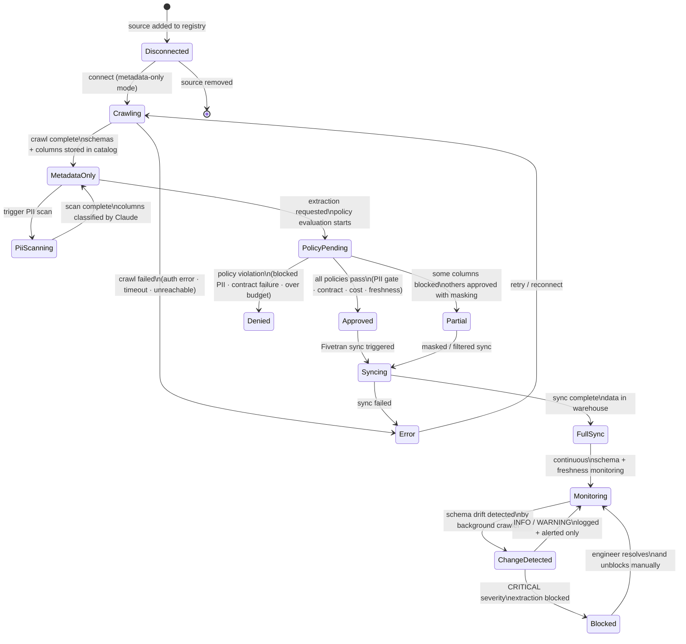

# State Machine — Source Connection Lifecycle

```mermaid
stateDiagram-v2
    [*] --> Disconnected : source added to registry

    Disconnected --> Crawling : connect (metadata-only mode)

    Crawling --> MetadataOnly : crawl complete\nschemas + columns stored in catalog
    Crawling --> Error : crawl failed\n(auth error · timeout · unreachable)

    MetadataOnly --> PiiScanning : trigger PII scan
    PiiScanning --> MetadataOnly : scan complete\ncolumns classified by Claude

    MetadataOnly --> PolicyPending : extraction requested\npolicy evaluation starts
    PolicyPending --> Approved : all policies pass\n(PII gate · contract · cost · freshness)
    PolicyPending --> Denied : policy violation\n(blocked PII · contract failure · over budget)
    PolicyPending --> Partial : some columns blocked\nothers approved with masking

    Approved --> Syncing : Fivetran sync triggered
    Partial --> Syncing : masked / filtered sync

    Syncing --> FullSync : sync complete\ndata in warehouse
    Syncing --> Error : sync failed

    FullSync --> Monitoring : continuous\nschema + freshness monitoring
    Monitoring --> ChangeDetected : schema drift detected\nby background crawler

    ChangeDetected --> Blocked : CRITICAL severity\nextraction blocked
    ChangeDetected --> Monitoring : INFO / WARNING\nlogged + alerted only

    Blocked --> Monitoring : engineer resolves\nand unblocks manually

    Error --> Crawling : retry / reconnect
    Disconnected --> [*] : source removed
```
